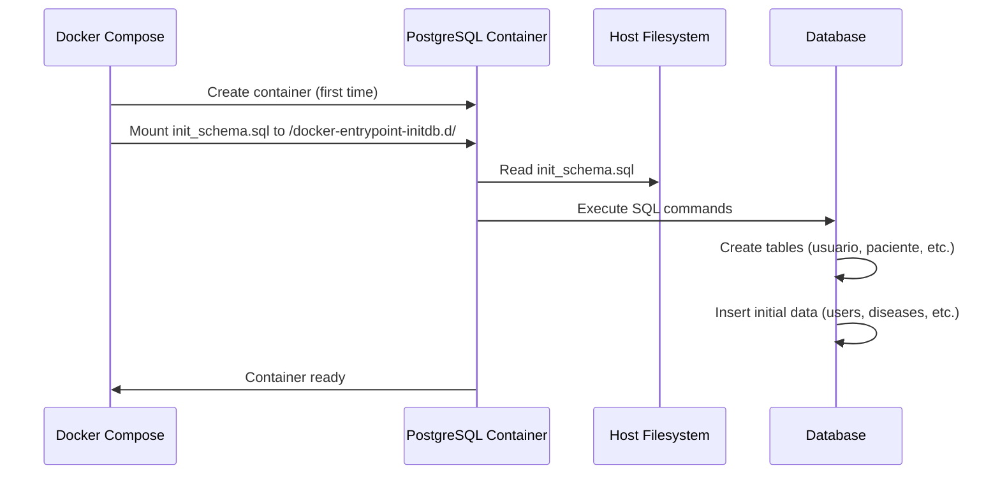

# Design Document

## Overview

Este diseño soluciona el problema de inicialización de la base de datos en OncoDerma. El problema raíz es que el archivo `init_schema.sql` no está siendo montado en el contenedor de PostgreSQL, lo que impide que se ejecute automáticamente durante la creación del contenedor.

La solución consiste en agregar un volume mount en el archivo `docker-compose.yml` que monte el archivo `init_schema.sql` en el directorio `/docker-entrypoint-initdb.d/` del contenedor de PostgreSQL. Este es un directorio especial que PostgreSQL monitorea y ejecuta automáticamente todos los archivos `.sql` que encuentra allí durante la primera inicialización.

## Architecture

### Current Architecture (Broken)

```
Host Machine                    Docker Container (postgres)
├── init_schema.sql            ├── /var/lib/postgresql/data (mounted)
├── docker-compose.yml         └── /docker-entrypoint-initdb.d/ (empty)
└── ...                             ❌ init_schema.sql NOT HERE
```

### Fixed Architecture

```
Host Machine                    Docker Container (postgres)
├── init_schema.sql ─────────► ├── /docker-entrypoint-initdb.d/init_schema.sql
├── docker-compose.yml         │   ✅ PostgreSQL executes this on first run
└── ...                        └── /var/lib/postgresql/data (mounted)
```

### Component Interaction



## Components and Interfaces

### 1. Docker Compose Configuration

**File:** `docker-compose.yml`

**Changes Required:**
- Add volume mount for `init_schema.sql` in the `postgres` service
- Mount to `/docker-entrypoint-initdb.d/init_schema.sql`

**Configuration:**
```yaml
postgres:
  image: postgres:16-alpine
  container_name: postgres
  ports:
    - "5432:5432"
  environment:
    POSTGRES_USER: admin
    POSTGRES_PASSWORD: admin123
    POSTGRES_DB: appdb
  volumes:
    - postgres_data:/var/lib/postgresql/data
    - ./init_schema.sql:/docker-entrypoint-initdb.d/init_schema.sql  # ✅ NEW
  networks:
    - app-network
  healthcheck:
    test: ["CMD-SHELL", "pg_isready -U admin -d appdb"]
    interval: 10s
    timeout: 5s
    retries: 5
    start_period: 10s
```

### 2. Database Schema File

**File:** `init_schema.sql`

**Current Status:** ✅ Already exists and is correct

**Contents:**
- Table definitions (usuario, paciente, historia_clinica, enfermedad, zona_clinica, sexo)
- Initial data for users (matias, carlos, bianca, melissa with password '1234')
- Reference data (diseases, clinical zones, sexes)
- Test data (10 patients, 10 clinical history records)

**No changes required** - the file is already correct.

### 3. Backend Login Endpoint

**File:** `backend/fastapi_skin_demo/app/main.py`

**Current Status:** ✅ Already correct

**Functionality:**
- Connects to PostgreSQL using DATABASE_URL environment variable
- Queries usuario table with case-insensitive username matching
- Compares plain-text passwords
- Returns user ID and username on success

**No changes required** - the endpoint is already working correctly.

### 4. Frontend Login Component

**File:** `frontend/src/pages/Login.jsx`

**Current Status:** ✅ Already correct

**Functionality:**
- Sends username and password as FormData to `/api/login`
- Stores userId and username in localStorage on success
- Displays error messages on failure

**No changes required** - the component is already working correctly.

## Data Models

### Database Schema

The database schema is already correctly defined in `init_schema.sql`. No changes needed.

**Key Tables:**
- `usuario`: Stores user credentials (id, nombre, password)
- `paciente`: Stores patient information
- `historia_clinica`: Stores analysis history with TOP 3 diseases
- `enfermedad`: Reference table for diseases
- `zona_clinica`: Reference table for clinical zones
- `sexo`: Reference table for sex

## Correctness Properties

*A property is a characteristic or behavior that should hold true across all valid executions of a system-essentially, a formal statement about what the system should do. Properties serve as the bridge between human-readable specifications and machine-verifiable correctness guarantees.*

### Property 1: Init script execution on first run

*For any* fresh PostgreSQL container (with no existing data volume), when the container starts, the init_schema.sql file should be executed exactly once, and all tables and initial data should be created.

**Validates: Requirements 1.1, 1.2, 1.3, 1.4**

### Property 2: Init script idempotency

*For any* existing PostgreSQL container (with existing data volume), when the container restarts, the init_schema.sql file should NOT be executed again, and existing data should remain unchanged.

**Validates: Requirements 1.5**

### Property 3: Volume mount accessibility

*For any* PostgreSQL container with the volume mount configured, the init_schema.sql file should be readable from within the container at the path `/docker-entrypoint-initdb.d/init_schema.sql`.

**Validates: Requirements 2.1, 2.2, 2.3**

### Property 4: User authentication success

*For any* valid username-password pair from the initial data (matias/1234, carlos/1234, bianca/1234, melissa/1234), the login endpoint should return success with the correct user ID and username.

**Validates: Requirements 3.1, 3.3, 3.4**

### Property 5: User authentication failure

*For any* invalid username-password pair (non-existent user or wrong password), the login endpoint should return an error status and appropriate error message.

**Validates: Requirements 3.2**

### Property 6: Database reset capability

*For any* PostgreSQL container, when the data volume is deleted and the container is recreated, the init_schema.sql should execute again and restore all initial data.

**Validates: Requirements 4.1, 4.2, 4.3**

## Error Handling

### 1. File Not Found

**Scenario:** init_schema.sql file doesn't exist at the specified path

**Handling:**
- Docker Compose will fail to start the postgres container
- Error message will indicate the file cannot be found
- User should verify the file exists in the project root

### 2. SQL Syntax Errors

**Scenario:** init_schema.sql contains invalid SQL

**Handling:**
- PostgreSQL will log the error during initialization
- Container will start but database will be incomplete
- Check container logs: `docker logs postgres`

### 3. Permission Issues

**Scenario:** init_schema.sql file has incorrect permissions

**Handling:**
- Docker may fail to mount the file
- Ensure file has read permissions for the Docker user
- On Windows, this is typically not an issue

### 4. Volume Already Exists

**Scenario:** Trying to reinitialize but volume already has data

**Handling:**
- PostgreSQL will skip init scripts if data directory is not empty
- To force reinitialization: `docker-compose down -v` (removes volumes)
- Then `docker-compose up -d` to recreate with fresh data

## Testing Strategy

### Manual Testing

1. **Test Fresh Installation:**
   ```powershell
   # Stop and remove everything
   docker-compose down -v
   
   # Start fresh
   docker-compose up -d
   
   # Wait for postgres to be healthy
   docker-compose ps
   
   # Verify users exist
   docker exec postgres psql -U admin -d appdb -c "SELECT nombre FROM usuario;"
   
   # Expected: 4 users (matias, carlos, bianca, melissa)
   ```

2. **Test Login Endpoint:**
   ```powershell
   # Test valid credentials
   $body = @{username='matias'; password='1234'}
   Invoke-WebRequest -Uri "http://localhost/api/login" -Method POST -Body $body
   
   # Expected: {"success":true,"message":"Login exitoso","user":{"id":1,"username":"matias"}}
   ```

3. **Test Invalid Credentials:**
   ```powershell
   # Test invalid password
   $body = @{username='matias'; password='wrong'}
   Invoke-WebRequest -Uri "http://localhost/api/login" -Method POST -Body $body
   
   # Expected: {"success":false,"message":"Usuario o contraseña incorrectos"}
   ```

4. **Test Frontend Login:**
   - Open http://localhost/login
   - Enter username: matias
   - Enter password: 1234
   - Click "Iniciar Sesión"
   - Expected: Redirect to home page

5. **Test Volume Mount:**
   ```powershell
   # Check if file is mounted
   docker exec postgres ls -la /docker-entrypoint-initdb.d/
   
   # Expected: init_schema.sql should be listed
   ```

6. **Test Database Reset:**
   ```powershell
   # Remove volumes
   docker-compose down -v
   
   # Recreate
   docker-compose up -d
   
   # Verify data is restored
   docker exec postgres psql -U admin -d appdb -c "SELECT COUNT(*) FROM usuario;"
   
   # Expected: 4
   ```

### Integration Testing

The system should be tested end-to-end:

1. Fresh installation → Database initialized → Login works
2. Container restart → Data persists → Login still works
3. Volume deletion → Reinitialization → Login works again

### Verification Commands

```powershell
# 1. Check container status
docker-compose ps

# 2. Check postgres logs for init script execution
docker logs postgres | Select-String "init_schema"

# 3. Verify tables exist
docker exec postgres psql -U admin -d appdb -c "\dt"

# 4. Verify users exist
docker exec postgres psql -U admin -d appdb -c "SELECT * FROM usuario;"

# 5. Test login endpoint
$body = @{username='matias'; password='1234'}
Invoke-WebRequest -Uri "http://localhost/api/login" -Method POST -Body $body

# 6. Check volume mount
docker exec postgres ls -la /docker-entrypoint-initdb.d/
```

## Implementation Notes

### Why This Solution Works

PostgreSQL's official Docker image has a special feature: it automatically executes any `.sql` or `.sh` files found in `/docker-entrypoint-initdb.d/` during the first initialization (when the data directory is empty).

By mounting our `init_schema.sql` file to this directory, we leverage this built-in functionality without needing any custom scripts or manual intervention.

### When Init Scripts Run

- ✅ **First time:** When container is created with empty data volume
- ❌ **Restart:** When container restarts with existing data
- ✅ **After volume deletion:** When volume is deleted and container recreated

### Alternative Solutions Considered

1. **Manual SQL execution:** Requires manual intervention, not automated
2. **Custom entrypoint script:** More complex, unnecessary when built-in feature exists
3. **Application-level migrations:** Adds complexity to backend code
4. **Pre-built database image:** Harder to maintain and update

The chosen solution (volume mount) is the simplest and most maintainable.

## Security Considerations

### Current State (Development)

- Passwords stored in plain text
- No password hashing
- Simple username/password authentication
- No session management beyond localStorage

### Future Improvements (Production)

1. **Password Hashing:** Use bcrypt or argon2 to hash passwords
2. **JWT Tokens:** Implement token-based authentication
3. **HTTPS:** Use TLS for encrypted communication
4. **Session Management:** Implement proper session handling
5. **Rate Limiting:** Prevent brute force attacks
6. **Password Policies:** Enforce strong passwords

**Note:** Current implementation is acceptable for development/demo purposes only.
